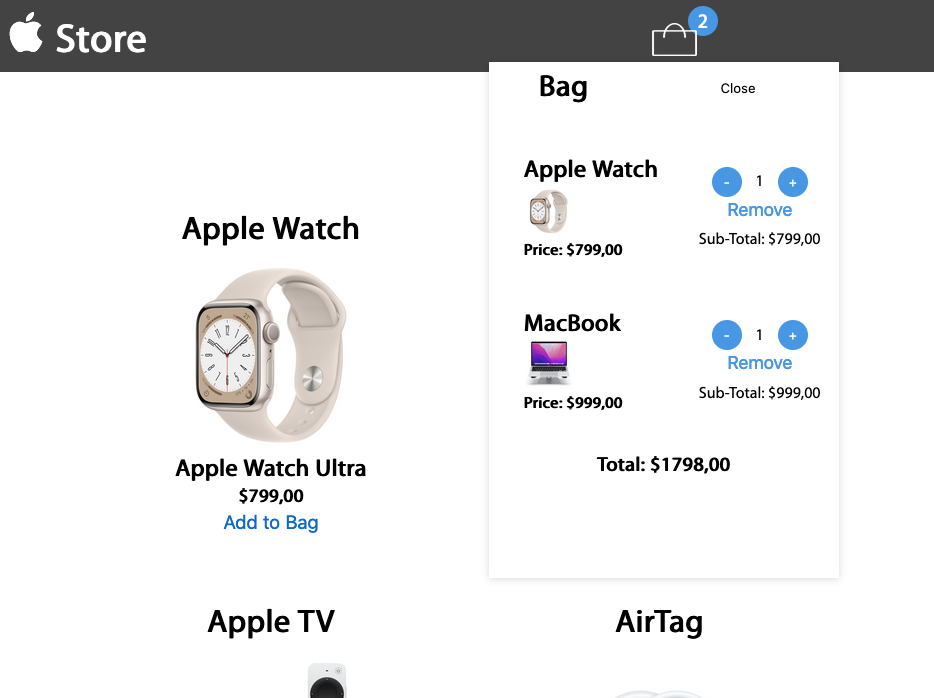

# APPLE STORE/BAG :shopping_cart:

## Desafio Fernandev. Objetivos :  

Criar um carrinho de compras totalmente interativo. O usuário deve poder:

- adicionar um novo produto
- remover um produto
- alterar a quantidade
- a quantidade não pode ser menor que 01
- calcular soma total do preço dos produtos inseridos de acordo com suas quantidades

Create a fully interactive shopping cart. The user should be able to:

- Add a new product
- Remove a product
- Change the quantity
- The quantity should not be less than 01
- Calculate the total price of the products inserted according to their quantities.

#  	:globe_with_meridians: Deployment:
<h1 style="font-size:20px;">https://applestore-joaquim.vercel.app/</h1>  

